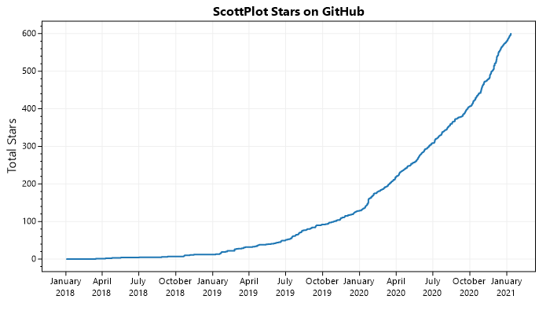

# StarGraph

**StarGraph uses Azure Functions to automatically generate graphs of GitHub stars over time** and save them as web-accessible static images that can be displayed inside GitHub readme pages.

> ⚠️ this image is not yet live

